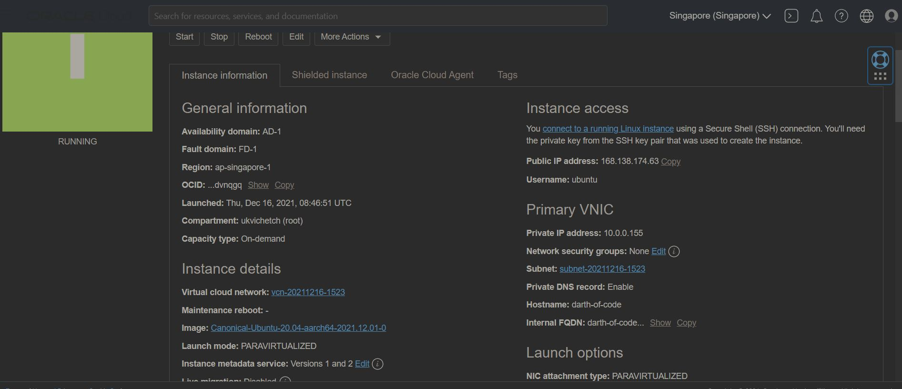

# connect oracle linux to internet

ref [oracle doc](https://docs.oracle.com/en-us/iaas/developer-tutorials/tutorials/apache-on-ubuntu/01oci-ubuntu-apache-summary.htm)

## create ingress rule

by default oracle vm doent use ufw for firewall,
you can make sure it doest work by

> sudo ufw status

you will get

> inactive

as a result

## opening port 80 to the internet

once opening port our vm will be accessible via internet
by default it is only accessible via ssh

- go to vm instance detail
  
- go to Virtual cloud network: vcn-20211216-1523
- go to subnet
  
- go to security
  
- click on "add ingress rules" and fill in the following data
  
- Fill in the ingress rule as follows:

  - Stateless: Checked
  - Source Type: CIDR
  - Source CIDR: 0.0.0.0/0
  - IP Protocol: TCP
  - Source port range: (leave-blank)
  - Destination Port Range: 80
  - Description: Allow HTTP connections

## update iptables

The Ubuntu firewall is disabled by default. However, you still need to update your iptables configuration to allow HTTP traffic. Update iptables with the following commands.

- accept port 80
  > sudo iptables -I INPUT 6 -m state --state NEW -p tcp --dport 80 -j ACCEPT
- accept port 443 (ssh)
  > sudo iptables -I INPUT 6 -m state --state NEW -p tcp --dport 80 -j ACCEPT
- persist (save) records
  > sudo netfilter-persistent save
- if not then install iptables-persistent
  > sudo apt install iptables-persistent
